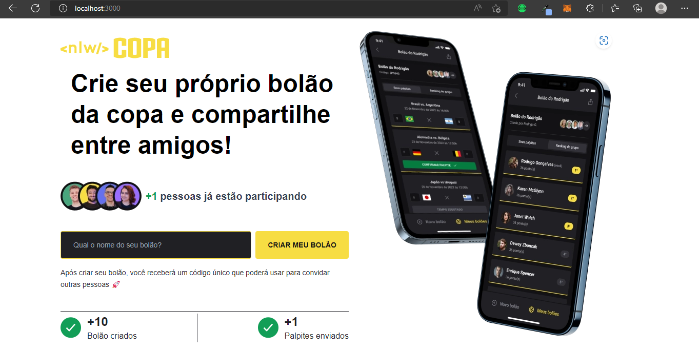

<h1 align="center">
NLW Bolão COPA
</h1>

## Participantes

[Luciano Ribeiro](https://github.com/lucianorbr)

## 🚀 Tecnologias e ferramentas utilizadas

<table>
  <tbody>
    <tr>
      <td style="font-weight: bold">Back-end</td>
      <td>
        <a href="https://nodejs.org/en/" target="_blank" rel="noopener noreferrer">NodeJs</a>
        e
        <a href="https://www.prisma.io/" target="_blank" rel="noopener noreferrer">Prisma</a>
      </td>
    </tr>
    <tr>
      <td style="font-weight: bold">Front-end (web)</td>
      <td>
        <a href="https://reactjs.org/" target="_blank" rel="noopener noreferrer">React</a>,
        <a href="https://www.typescriptlang.org/" target="_blank" rel="noopener noreferrer">TypeScript</a>,
        <a href="https://nextjs.org/" target="_blank" rel="noopener noreferrer">NextJS</a>
      </td>
    </tr>
    <tr>
    </tr>
  </tbody>
</table>

## O Projeto

**NLW Copa** é o projeto desenvolvido durante a trilha Ignite da **Next Level Week**, um evento online produzido pela [**Rocketseat**](https://github.com/Rocketseat).

O projeto consiste em uma aplicação com a temática da copa, que permitirá os usuários criarem seus próprios bolões da copa e compartilhá-los com seus amigos.

## Como contribuir

- [x] Faça um fork desse repositório;
- [x] Cria uma branch com a sua feature: `git checkout -b minha-feature`;
- [x] Faça commit das suas alterações: `git commit -m 'feat: Minha nova feature'`;
- [x] Faça push para a sua branch: `git push origin minha-feature`.
- [x] Depois que o merge da sua pull request for feito, você pode deletar a sua branch.
- [x] Entre em contato com o desenvolvedor do projeto para que possamos avaliar sua contribuição.
- [x] Agradecemos a sua contribuição!

## 📲 Contato

Entre em contato comigo por e-mail ou pelo meu LinkedIn:

## 📝 Licença

Esse projeto está sob a licença **MIT**. Veja o arquivo _**LICENSE**_ para mais detalhes.

---

<h5 align="center">
  &copy;2022 - <a href="https://github.com/lucianorbr/">Luciano Ribeiro</a>
</h5>